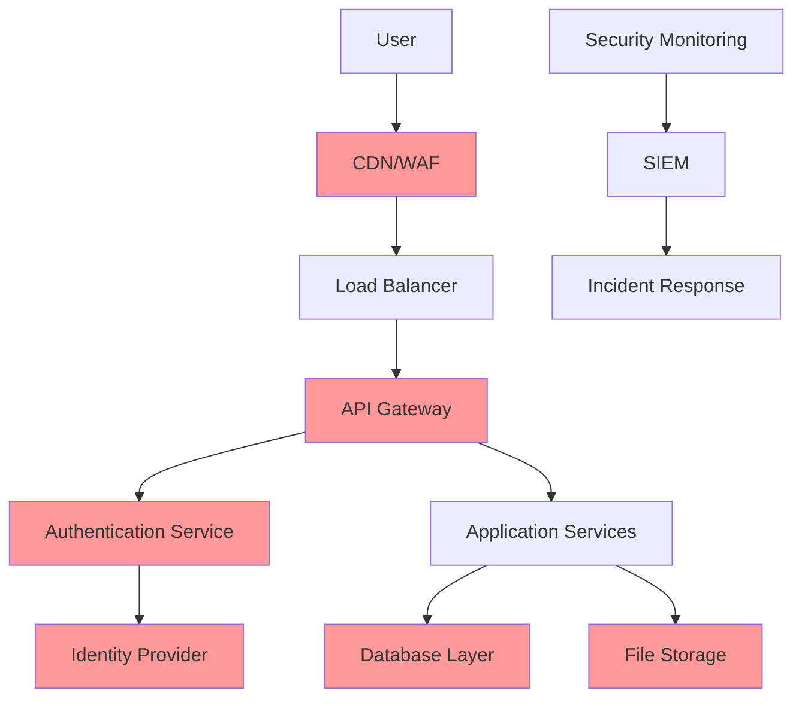

# Security Documentation - Plastic Crack

## Table of Contents
1. [Security Overview](#1-security-overview)
2. [Data Classification](#2-data-classification)
3. [Authentication & Authorization](#3-authentication--authorization)
4. [Data Encryption](#4-data-encryption)
5. [Network Security](#5-network-security)
6. [Application Security](#6-application-security)
7. [Infrastructure Security](#7-infrastructure-security)
8. [Privacy & Compliance](#8-privacy--compliance)
9. [Incident Response](#9-incident-response)
10. [Security Monitoring](#10-security-monitoring)

## 1. Security Overview

### 1.1 Security Architecture Principles

The Plastic Crack platform implements a defense-in-depth security model with multiple layers of protection:

- **Zero Trust Architecture**: Never trust, always verify
- **Principle of Least Privilege**: Minimal access rights
- **Defense in Depth**: Multiple security layers
- **Fail Secure**: System fails to a secure state
- **Security by Design**: Built-in from the start

### 1.2 Threat Model

#### Primary Threats
1. **Data Breaches**: Unauthorized access to user collections and personal data
2. **Account Takeover**: Malicious access to user accounts
3. **Data Manipulation**: Unauthorized modification of collection data
4. **Service Disruption**: DDoS and availability attacks
5. **Privacy Violations**: Exposure of personal information

#### Attack Vectors
- Web application vulnerabilities (OWASP Top 10)
- Mobile application security flaws
- API security weaknesses
- Social engineering attacks
- Third-party service compromises

### 1.3 Security Controls Framework



## 2. Data Classification

### 2.1 Data Categories

#### Highly Sensitive Data (RED)
- User authentication credentials
- Payment information
- Personal identifiable information (PII)
- Private messages between users

**Protection Requirements:**
- Encryption at rest with customer-managed keys
- Encryption in transit with TLS 1.3
- Access logging and monitoring
- Data residency compliance

#### Sensitive Data (AMBER)
- User profile information
- Collection data marked as private
- User preferences and settings
- Purchase history

**Protection Requirements:**
- Encryption at rest with platform-managed keys
- Encryption in transit with TLS 1.2+
- Access controls and authorization
- Regular backup and recovery testing

#### Internal Data (GREEN)
- Public collection data
- Product catalog information
- Aggregated analytics data
- Public forum posts

**Protection Requirements:**
- Standard encryption in transit
- Basic access controls
- Standard backup procedures

### 2.2 Data Flow Security

```typescript
// Data classification tagging
interface DataClassification {
  level: 'RED' | 'AMBER' | 'GREEN';
  encryption_required: boolean;
  access_logging: boolean;
  retention_period: string;
  geographic_restrictions?: string[];
}

// Example data handling
const userProfileData: DataClassification = {
  level: 'AMBER',
  encryption_required: true,
  access_logging: true,
  retention_period: '7_years',
  geographic_restrictions: ['EU', 'US']
};

const publicCollectionData: DataClassification = {
  level: 'GREEN',
  encryption_required: false,
  access_logging: false,
  retention_period: 'indefinite'
};
```

## 3. Authentication & Authorization

### 3.1 Multi-Factor Authentication

#### Implementation Strategy
```typescript
// MFA configuration
const mfaConfig = {
  required_for: ['admin_users', 'payment_operations'],
  optional_for: ['standard_users'],
  methods: {
    totp: {
      enabled: true,
      issuer: 'Plastic Crack',
      algorithm: 'SHA1',
      digits: 6,
      period: 30
    },
    sms: {
      enabled: true,
      provider: 'firebase_auth',
      rate_limit: '5_per_hour'
    },
    email: {
      enabled: true,
      template: 'mfa_verification',
      expiry: '5_minutes'
    },
    backup_codes: {
      enabled: true,
      count: 10,
      one_time_use: true
    }
  }
};

// MFA enforcement middleware
const requireMFA = async (req, res, next) => {
  const user = req.user;
  const operation = req.route.operation_type;
  
  if (mfaConfig.required_for.includes(user.role) || 
      sensitiveOperations.includes(operation)) {
    
    if (!req.session.mfa_verified) {
      return res.status(403).json({
        error: 'MFA_REQUIRED',
        redirect: '/auth/mfa/challenge'
      });
    }
  }
  
  next();
};
```

### 3.2 Session Management

#### Secure Session Configuration
```typescript
// Session security settings
const sessionConfig = {
  cookie: {
    name: 'plastic_crack_session',
    secure: true,              // HTTPS only
    httpOnly: true,           // No JavaScript access
    sameSite: 'strict',       // CSRF protection
    maxAge: 15 * 60 * 1000,   // 15 minutes
    path: '/',
    domain: process.env.NODE_ENV === 'production' 
      ? '.plasticcrack.com' 
      : 'localhost'
  },
  rolling: true,              // Reset expiry on activity
  resave: false,
  saveUninitialized: false,
  store: new RedisStore({     // Secure session storage
    client: redisClient,
    prefix: 'sess:',
    ttl: 15 * 60             // Match cookie maxAge
  })
};

// Session validation middleware
const validateSession = async (req, res, next) => {
  const session = req.session;
  
  // Check session age
  if (session.created_at && 
      Date.now() - session.created_at > MAX_SESSION_AGE) {
    await req.session.destroy();
    return res.status(401).json({ error: 'SESSION_EXPIRED' });
  }
  
  // Check for session hijacking
  if (session.ip_address !== req.ip ||
      session.user_agent !== req.get('User-Agent')) {
    await logSecurityEvent('SESSION_HIJACKING_ATTEMPT', {
      user_id: session.user_id,
      original_ip: session.ip_address,
      current_ip: req.ip
    });
    await req.session.destroy();
    return res.status(401).json({ error: 'SESSION_INVALID' });
  }
  
  next();
};
```

### 3.3 Role-Based Access Control (RBAC)

#### Permission System
```typescript
// Permission definitions
const permissions = {
  'collection.read': 'Read collection data',
  'collection.write': 'Modify collection data',
  'collection.delete': 'Delete collection data',
  'collection.share': 'Share collection publicly',
  'admin.users': 'Manage user accounts',
  'admin.content': 'Moderate user content',
  'admin.system': 'System administration'
};

// Role definitions
const roles = {
  user: ['collection.read', 'collection.write', 'collection.share'],
  premium_user: ['collection.read', 'collection.write', 'collection.share'],
  moderator: ['collection.read', 'admin.content'],
  admin: Object.keys(permissions)
};

// Authorization middleware
const authorize = (requiredPermission: string) => {
  return async (req, res, next) => {
    const user = req.user;
    const userPermissions = roles[user.role] || [];
    
    if (!userPermissions.includes(requiredPermission)) {
      await logSecurityEvent('UNAUTHORIZED_ACCESS_ATTEMPT', {
        user_id: user.id,
        required_permission: requiredPermission,
        user_role: user.role,
        endpoint: req.path
      });
      
      return res.status(403).json({
        error: 'INSUFFICIENT_PERMISSIONS',
        required: requiredPermission
      });
    }
    
    next();
  };
};
```

## 4. Data Encryption

### 4.1 Encryption at Rest

#### Database Encryption
```typescript
// Field-level encryption for sensitive data
import crypto from 'crypto';
import { KMS } from '@google-cloud/kms';

class FieldEncryption {
  private kmsClient: KMS;
  private keyName: string;

  constructor() {
    this.kmsClient = new KMS();
    this.keyName = 'projects/plastic-crack/locations/global/keyRings/main/cryptoKeys/user-data';
  }

  async encryptField(plaintext: string, context: string): Promise<string> {
    const [result] = await this.kmsClient.encrypt({
      name: this.keyName,
      plaintext: Buffer.from(plaintext),
      additionalAuthenticatedData: Buffer.from(context)
    });
    
    return result.ciphertext.toString('base64');
  }

  async decryptField(ciphertext: string, context: string): Promise<string> {
    const [result] = await this.kmsClient.decrypt({
      name: this.keyName,
      ciphertext: Buffer.from(ciphertext, 'base64'),
      additionalAuthenticatedData: Buffer.from(context)
    });
    
    return result.plaintext.toString();
  }
}

// Usage in data models
class UserModel {
  async saveUser(userData: UserData): Promise<void> {
    const encryption = new FieldEncryption();
    const context = `user:${userData.id}`;
    
    const encryptedData = {
      id: userData.id,
      username: userData.username,
      email: await encryption.encryptField(userData.email, context),
      phone: userData.phone ? 
        await encryption.encryptField(userData.phone, context) : null,
      created_at: new Date()
    };
    
    await db.table('users').insert(encryptedData);
  }
}
```

#### File Storage Encryption
```typescript
// Firebase Storage with encryption
import { Storage } from '@google-cloud/storage';

class SecureFileStorage {
  private storage: Storage;
  private bucketName: string;

  constructor() {
    this.storage = new Storage({
      projectId: 'plastic-crack-prod',
      keyFilename: './service-account-key.json'
    });
    this.bucketName = 'plastic-crack-secure-uploads';
  }

  async uploadSecureFile(
    file: Buffer, 
    fileName: string, 
    userId: string
  ): Promise<string> {
    const bucket = this.storage.bucket(this.bucketName);
    const fileObject = bucket.file(`users/${userId}/${fileName}`);
    
    // Client-side encryption before upload
    const encryptedBuffer = await this.encryptFile(file, userId);
    
    await fileObject.save(encryptedBuffer, {
      metadata: {
        contentType: 'application/octet-stream',
        metadata: {
          userId: userId,
          originalName: fileName,
          encrypted: 'true',
          uploadedAt: new Date().toISOString()
        }
      },
      // Server-side encryption
      encryptionKey: await this.getFileEncryptionKey(userId)
    });
    
    return fileObject.publicUrl();
  }

  private async encryptFile(buffer: Buffer, userId: string): Promise<Buffer> {
    const key = await this.getFileEncryptionKey(userId);
    const iv = crypto.randomBytes(16);
    const cipher = crypto.createCipher('aes-256-gcm', key);
    
    const encrypted = Buffer.concat([
      iv,
      cipher.update(buffer),
      cipher.final(),
      cipher.getAuthTag()
    ]);
    
    return encrypted;
  }
}
```

### 4.2 Encryption in Transit

#### TLS Configuration
```typescript
// Express.js TLS configuration
import https from 'https';
import fs from 'fs';

const tlsOptions = {
  key: fs.readFileSync('./certs/private-key.pem'),
  cert: fs.readFileSync('./certs/certificate.pem'),
  
  // TLS 1.3 only
  secureProtocol: 'TLSv1_3_method',
  
  // Strong cipher suites
  ciphers: [
    'TLS_AES_256_GCM_SHA384',
    'TLS_CHACHA20_POLY1305_SHA256',
    'TLS_AES_128_GCM_SHA256'
  ].join(':'),
  
  // Security headers
  honorCipherOrder: true,
  
  // Client certificate validation (for admin endpoints)
  requestCert: false,
  rejectUnauthorized: false,
  
  // HSTS
  maxAge: 31536000,
  includeSubDomains: true,
  preload: true
};

const server = https.createServer(tlsOptions, app);
```

#### API Communication Security
```typescript
// Secure API client
class SecureAPIClient {
  private baseURL: string;
  private apiKey: string;

  constructor() {
    this.baseURL = process.env.API_BASE_URL;
    this.apiKey = process.env.API_KEY;
  }

  async makeSecureRequest(endpoint: string, data?: any): Promise<any> {
    const timestamp = Date.now().toString();
    const nonce = crypto.randomBytes(16).toString('hex');
    
    // Create message signature
    const message = `${endpoint}${timestamp}${nonce}${JSON.stringify(data || {})}`;
    const signature = crypto
      .createHmac('sha256', this.apiKey)
      .update(message)
      .digest('hex');
    
    const response = await fetch(`${this.baseURL}${endpoint}`, {
      method: 'POST',
      headers: {
        'Content-Type': 'application/json',
        'X-API-Timestamp': timestamp,
        'X-API-Nonce': nonce,
        'X-API-Signature': signature,
        'User-Agent': 'PlasticCrack/1.0'
      },
      body: JSON.stringify(data)
    });
    
    if (!response.ok) {
      throw new Error(`API request failed: ${response.statusText}`);
    }
    
    return response.json();
  }
}
```

## 5. Network Security

### 5.1 Cloud Armor Security Policies

#### DDoS Protection Configuration
```yaml
# Cloud Armor security policy
name: plastic-crack-security-policy
description: "Comprehensive security policy for Plastic Crack"

rules:
  # Rate limiting for API endpoints
  - priority: 1000
    match:
      expr:
        expression: "request.path.startsWith('/api/')"
    action: "rate_based_ban"
    rateLimitOptions:
      rateLimitThreshold:
        count: 100
        intervalSec: 60
      banThreshold:
        count: 1000
        intervalSec: 600
      banDurationSec: 3600
    
  # Block known malicious IPs
  - priority: 2000
    match:
      versionedExpr: SRC_IPS_V1
      config:
        srcIpRanges:
          - "198.51.100.0/24"  # Example malicious range
    action: "deny-403"
    
  # Geographic restrictions for admin endpoints
  - priority: 3000
    match:
      expr:
        expression: |
          request.path.startsWith('/admin/') && 
          !inIpRange(origin.ip, '192.168.1.0/24') &&
          !origin.region_code in ['US', 'GB', 'CA']
    action: "deny-403"
    
  # Bot detection and rate limiting
  - priority: 4000
    match:
      expr:
        expression: |
          request.headers['user-agent'].contains('bot') ||
          request.headers['user-agent'].contains('crawler') ||
          request.headers['user-agent'].contains('spider')
    action: "rate_based_ban"
    rateLimitOptions:
      rateLimitThreshold:
        count: 10
        intervalSec: 60
```

### 5.2 Web Application Firewall (WAF)

#### OWASP Rule Set Implementation
```typescript
// Custom WAF rules for application-specific protection
const wafRules = {
  // SQL Injection protection
  sql_injection: {
    patterns: [
      /(\s|^)(union|select|insert|update|delete|drop|create|alter)(\s|$)/i,
      /(\'|\")(\s)*(or|and)(\s)*(\d|\')(\s)*=(\s)*(\d|\')/i,
      /(\-\-|\#|\/\*|\*\/)/
    ],
    action: 'block',
    severity: 'high'
  },
  
  // XSS protection
  xss_protection: {
    patterns: [
      /<script[^>]*>.*?<\/script>/gi,
      /javascript:/gi,
      /on\w+\s*=/gi,
      /<iframe[^>]*>.*?<\/iframe>/gi
    ],
    action: 'sanitize',
    severity: 'medium'
  },
  
  // Path traversal protection
  path_traversal: {
    patterns: [
      /\.\.\//g,
      /\.\.\\/g,
      /%2e%2e%2f/gi,
      /%2e%2e%5c/gi
    ],
    action: 'block',
    severity: 'high'
  }
};

// WAF middleware implementation
const wafMiddleware = (req, res, next) => {
  const userInput = {
    ...req.query,
    ...req.body,
    ...req.params
  };
  
  for (const [ruleName, rule] of Object.entries(wafRules)) {
    for (const [key, value] of Object.entries(userInput)) {
      if (typeof value === 'string') {
        for (const pattern of rule.patterns) {
          if (pattern.test(value)) {
            logSecurityEvent('WAF_RULE_TRIGGERED', {
              rule: ruleName,
              severity: rule.severity,
              input: value,
              ip: req.ip,
              user_agent: req.get('User-Agent')
            });
            
            if (rule.action === 'block') {
              return res.status(400).json({
                error: 'Request blocked by security policy',
                reference: generateIncidentId()
              });
            } else if (rule.action === 'sanitize') {
              req.body[key] = value.replace(pattern, '');
            }
          }
        }
      }
    }
  }
  
  next();
};
```

## 6. Application Security

### 6.1 Input Validation and Sanitization

#### Comprehensive Validation Framework
```typescript
import joi from 'joi';
import DOMPurify from 'dompurify';
import validator from 'validator';

// Custom validation schemas
const validationSchemas = {
  userRegistration: joi.object({
    email: joi.string()
      .email({ minDomainSegments: 2, tlds: { allow: ['com', 'net', 'org'] } })
      .required(),
    password: joi.string()
      .min(12)
      .pattern(/^(?=.*[a-z])(?=.*[A-Z])(?=.*\d)(?=.*[@$!%*?&])[A-Za-z\d@$!%*?&]/)
      .required(),
    username: joi.string()
      .alphanum()
      .min(3)
      .max(30)
      .required()
  }),
  
  modelEntry: joi.object({
    name: joi.string()
      .trim()
      .max(255)
      .pattern(/^[a-zA-Z0-9\s\-\'\.\,]+$/)
      .required(),
    faction: joi.string()
      .valid('space_marines', 'chaos', 'orks', 'eldar', 'tau', 'necrons', 'tyranids')
      .required(),
    game_system: joi.string()
      .valid('40k', 'aos', 'kill_team', 'necromunda', 'blood_bowl')
      .required(),
    points_value: joi.number()
      .integer()
      .min(0)
      .max(9999),
    notes: joi.string()
      .max(5000)
      .allow('')
  })
};

// Advanced sanitization service
class InputSanitizer {
  static sanitizeText(input: string): string {
    // Remove potentially dangerous characters
    let sanitized = input.replace(/[<>\"'&]/g, (match) => {
      const entityMap = {
        '<': '&lt;',
        '>': '&gt;',
        '"': '&quot;',
        "'": '&#39;',
        '&': '&amp;'
      };
      return entityMap[match];
    });
    
    // Remove control characters
    sanitized = sanitized.replace(/[\x00-\x1F\x7F]/g, '');
    
    // Normalize whitespace
    sanitized = sanitized.replace(/\s+/g, ' ').trim();
    
    return sanitized;
  }
  
  static sanitizeHTML(input: string): string {
    return DOMPurify.sanitize(input, {
      ALLOWED_TAGS: [],
      ALLOWED_ATTR: [],
      RETURN_DOM: false,
      RETURN_DOM_FRAGMENT: false
    });
  }
  
  static validateAndSanitizeURL(input: string): string | null {
    if (!validator.isURL(input, {
      protocols: ['http', 'https'],
      require_protocol: true,
      allow_underscores: false
    })) {
      return null;
    }
    
    return validator.escape(input);
  }
}
```

### 6.2 Cross-Site Scripting (XSS) Prevention

#### Content Security Policy Implementation
```typescript
// CSP configuration
const cspConfig = {
  directives: {
    defaultSrc: ["'self'"],
    
    scriptSrc: [
      "'self'",
      "'unsafe-inline'", // Only for specific inline scripts with nonces
      "https://apis.google.com",
      "https://www.googletagmanager.com"
    ],
    
    styleSrc: [
      "'self'",
      "'unsafe-inline'", // For CSS-in-JS libraries
      "https://fonts.googleapis.com"
    ],
    
    imgSrc: [
      "'self'",
      "data:",
      "https://storage.googleapis.com",
      "https://firebasestorage.googleapis.com"
    ],
    
    connectSrc: [
      "'self'",
      "https://api.plasticcrack.com",
      "https://identitytoolkit.googleapis.com",
      "wss://plastic-crack-websocket.com"
    ],
    
    fontSrc: [
      "'self'",
      "https://fonts.gstatic.com"
    ],
    
    objectSrc: ["'none'"],
    
    mediaSrc: ["'self'"],
    
    frameSrc: ["'none'"],
    
    // Report violations
    reportUri: "/api/csp-violation-report"
  },
  reportOnly: false
};

// CSP nonce generation for inline scripts
const generateCSPNonce = (): string => {
  return crypto.randomBytes(16).toString('base64');
};

// CSP middleware
const cspMiddleware = (req, res, next) => {
  const nonce = generateCSPNonce();
  req.cspNonce = nonce;
  
  // Add nonce to script-src
  const cspHeader = Object.entries(cspConfig.directives)
    .map(([directive, sources]) => {
      if (directive === 'scriptSrc') {
        sources.push(`'nonce-${nonce}'`);
      }
      return `${directive.replace(/[A-Z]/g, '-$&').toLowerCase()} ${sources.join(' ')}`;
    })
    .join('; ');
  
  res.setHeader('Content-Security-Policy', cspHeader);
  next();
};
```

### 6.3 Cross-Site Request Forgery (CSRF) Protection

#### CSRF Token Implementation
```typescript
import csrf from 'csurf';

// CSRF protection configuration
const csrfProtection = csrf({
  cookie: {
    name: '_csrf',
    httpOnly: true,
    secure: process.env.NODE_ENV === 'production',
    sameSite: 'strict',
    maxAge: 3600000 // 1 hour
  },
  ignoreMethods: ['GET', 'HEAD', 'OPTIONS'],
  value: (req) => {
    return req.body._csrf || 
           req.query._csrf || 
           req.headers['x-csrf-token'] ||
           req.headers['x-xsrf-token'];
  }
});

// Custom CSRF validation for API requests
const validateCSRFToken = async (req, res, next) => {
  if (['GET', 'HEAD', 'OPTIONS'].includes(req.method)) {
    return next();
  }
  
  const token = req.headers['x-csrf-token'];
  const sessionToken = req.session.csrfToken;
  
  if (!token || !sessionToken || token !== sessionToken) {
    await logSecurityEvent('CSRF_TOKEN_MISMATCH', {
      user_id: req.user?.id,
      provided_token: token,
      ip: req.ip,
      endpoint: req.path
    });
    
    return res.status(403).json({
      error: 'CSRF token validation failed'
    });
  }
  
  next();
};
```

## 7. Infrastructure Security

### 7.1 Container Security

#### Docker Security Best Practices
```dockerfile
# Secure Dockerfile for Node.js application
FROM node:18-alpine AS base

# Create non-root user
RUN addgroup -g 1001 -S nodejs
RUN adduser -S plastic-crack -u 1001

# Set working directory
WORKDIR /app

# Copy package files
COPY package*.json ./

# Install dependencies
RUN npm ci --only=production && npm cache clean --force

# Copy application code
COPY --chown=plastic-crack:nodejs . .

# Remove unnecessary packages
RUN apk del wget curl

# Set security headers
ENV NODE_ENV=production
ENV NODE_OPTIONS="--max-old-space-size=1024"

# Use non-root user
USER plastic-crack

# Expose port
EXPOSE 3000

# Health check
HEALTHCHECK --interval=30s --timeout=3s --start-period=5s --retries=3 \
  CMD node healthcheck.js

# Start application
CMD ["node", "dist/index.js"]
```

#### Kubernetes Security Configuration
```yaml
# k8s-security-policy.yaml
apiVersion: networking.k8s.io/v1
kind: NetworkPolicy
metadata:
  name: plastic-crack-network-policy
spec:
  podSelector:
    matchLabels:
      app: plastic-crack
  policyTypes:
  - Ingress
  - Egress
  ingress:
  - from:
    - podSelector:
        matchLabels:
          app: load-balancer
    ports:
    - protocol: TCP
      port: 3000
  egress:
  - to:
    - podSelector:
        matchLabels:
          app: postgres
    ports:
    - protocol: TCP
      port: 5432
  - to: []
    ports:
    - protocol: TCP
      port: 443  # HTTPS only

---
apiVersion: v1
kind: Pod
metadata:
  name: plastic-crack-app
spec:
  securityContext:
    runAsNonRoot: true
    runAsUser: 1001
    fsGroup: 1001
    seccompProfile:
      type: RuntimeDefault
  containers:
  - name: app
    image: plastic-crack:latest
    securityContext:
      allowPrivilegeEscalation: false
      readOnlyRootFilesystem: true
      capabilities:
        drop:
        - ALL
    resources:
      limits:
        cpu: 500m
        memory: 512Mi
      requests:
        cpu: 100m
        memory: 128Mi
```

### 7.2 Database Security

#### PostgreSQL Security Configuration
```sql
-- Database security setup
-- Create read-only user for analytics
CREATE ROLE analytics_reader WITH LOGIN PASSWORD 'secure_analytics_password';
GRANT CONNECT ON DATABASE plastic_crack TO analytics_reader;
GRANT USAGE ON SCHEMA public TO analytics_reader;
GRANT SELECT ON ALL TABLES IN SCHEMA public TO analytics_reader;

-- Create application user with limited privileges
CREATE ROLE app_user WITH LOGIN PASSWORD 'secure_app_password';
GRANT CONNECT ON DATABASE plastic_crack TO app_user;
GRANT USAGE ON SCHEMA public TO app_user;
GRANT SELECT, INSERT, UPDATE, DELETE ON user_models TO app_user;
GRANT SELECT ON warhammer_products TO app_user;

-- Enable row-level security
ALTER TABLE user_models ENABLE ROW LEVEL SECURITY;

-- Create RLS policy for user data isolation
CREATE POLICY user_models_isolation ON user_models
  FOR ALL
  TO app_user
  USING (user_id = current_setting('app.current_user_id')::uuid);

-- Audit logging configuration
CREATE EXTENSION IF NOT EXISTS pgaudit;
ALTER SYSTEM SET pgaudit.log = 'write, ddl';
ALTER SYSTEM SET pgaudit.log_level = 'log';
SELECT pg_reload_conf();

-- Connection security
ALTER SYSTEM SET ssl = on;
ALTER SYSTEM SET ssl_cert_file = '/etc/ssl/certs/server.crt';
ALTER SYSTEM SET ssl_key_file = '/etc/ssl/private/server.key';
ALTER SYSTEM SET ssl_min_protocol_version = 'TLSv1.2';
```

## 8. Privacy & Compliance

### 8.1 GDPR Compliance Implementation

#### Data Subject Rights Management
```typescript
// GDPR compliance service
class GDPRComplianceService {
  
  // Right to Access (Article 15)
  async exportUserData(userId: string): Promise<GDPRDataExport> {
    const userData = await this.collectAllUserData(userId);
    
    return {
      personal_data: {
        profile: userData.profile,
        preferences: userData.preferences,
        authentication_data: userData.auth_data
      },
      collection_data: userData.models,
      social_interactions: userData.social_data,
      system_logs: userData.audit_logs,
      export_metadata: {
        exported_at: new Date().toISOString(),
        export_format: 'JSON',
        legal_basis: 'Article 15 - Right of Access'
      }
    };
  }
  
  // Right to Rectification (Article 16)
  async updateUserData(userId: string, corrections: any): Promise<void> {
    await this.validateDataCorrections(corrections);
    
    await db.transaction(async (trx) => {
      // Log the data change for audit purposes
      await trx('data_change_log').insert({
        user_id: userId,
        change_type: 'rectification',
        legal_basis: 'Article 16 - Right to Rectification',
        changes: JSON.stringify(corrections),
        timestamp: new Date()
      });
      
      // Apply corrections
      await this.applyDataCorrections(userId, corrections, trx);
    });
  }
  
  // Right to Erasure (Article 17)
  async deleteUserData(userId: string, reason: string): Promise<void> {
    const retentionPeriod = await this.getDataRetentionPeriod(userId);
    
    if (retentionPeriod.has_legal_obligation) {
      // Anonymize instead of delete
      await this.anonymizeUserData(userId);
    } else {
      // Complete deletion
      await this.permanentlyDeleteUserData(userId);
    }
    
    // Log deletion for compliance
    await this.logGDPRAction('data_deletion', userId, {
      reason: reason,
      method: retentionPeriod.has_legal_obligation ? 'anonymization' : 'deletion'
    });
  }
  
  // Right to Data Portability (Article 20)
  async exportPortableData(userId: string, format: 'json' | 'csv'): Promise<Buffer> {
    const portableData = await this.getPortableUserData(userId);
    
    if (format === 'csv') {
      return this.convertToCSV(portableData);
    }
    
    return Buffer.from(JSON.stringify(portableData, null, 2));
  }
  
  // Privacy by Design implementation
  async processNewUserData(userData: any): Promise<any> {
    // Data minimization
    const minimizedData = this.minimizeDataCollection(userData);
    
    // Purpose limitation
    await this.validateDataPurpose(minimizedData);
    
    // Storage limitation
    await this.setDataRetentionSchedule(minimizedData);
    
    return minimizedData;
  }
}
```

### 8.2 Data Retention Policies

#### Automated Data Lifecycle Management
```typescript
// Data retention configuration
const retentionPolicies = {
  user_profiles: {
    active_users: '7_years',
    inactive_users: '3_years',
    deleted_accounts: '30_days_anonymized'
  },
  collection_data: {
    active_collections: 'indefinite_with_consent',
    orphaned_data: '1_year'
  },
  audit_logs: {
    security_logs: '7_years',
    access_logs: '1_year',
    error_logs: '6_months'
  },
  communication_data: {
    messages: '3_years',
    notifications: '1_year',
    support_tickets: '5_years'
  }
};

// Automated cleanup service
class DataRetentionService {
  async runRetentionCleanup(): Promise<void> {
    const cleanupTasks = [
      this.cleanupInactiveUsers(),
      this.cleanupOldAuditLogs(),
      this.cleanupOrphanedData(),
      this.cleanupExpiredSessions()
    ];
    
    await Promise.all(cleanupTasks);
  }
  
  private async cleanupInactiveUsers(): Promise<void> {
    const threeYearsAgo = new Date();
    threeYearsAgo.setFullYear(threeYearsAgo.getFullYear() - 3);
    
    const inactiveUsers = await db('users')
      .where('last_login_at', '<', threeYearsAgo)
      .whereNull('deletion_scheduled_at');
    
    for (const user of inactiveUsers) {
      await this.scheduleUserDataDeletion(user.id, '30_days');
    }
  }
  
  private async scheduleUserDataDeletion(userId: string, delay: string): Promise<void> {
    const deletionDate = this.calculateDeletionDate(delay);
    
    await db('users')
      .where('id', userId)
      .update({
        deletion_scheduled_at: deletionDate,
        retention_notice_sent: false
      });
    
    // Send retention notice to user
    await this.sendDataRetentionNotice(userId, deletionDate);
  }
}
```

## 9. Incident Response

### 9.1 Security Incident Classification

#### Incident Severity Levels
```typescript
enum IncidentSeverity {
  CRITICAL = 'critical',    // Active data breach, system compromise
  HIGH = 'high',           // Potential data exposure, service disruption
  MEDIUM = 'medium',       // Security policy violation, suspicious activity
  LOW = 'low'              // Minor security events, policy warnings
}

interface SecurityIncident {
  id: string;
  severity: IncidentSeverity;
  category: string;
  description: string;
  affected_systems: string[];
  affected_users: string[];
  detection_time: Date;
  response_team: string[];
  status: 'open' | 'investigating' | 'contained' | 'resolved';
  evidence: Evidence[];
}

// Incident response automation
class IncidentResponseService {
  async handleSecurityIncident(incident: SecurityIncident): Promise<void> {
    // Immediate automated response
    await this.executeImmediateResponse(incident);
    
    // Notify response team
    await this.notifyResponseTeam(incident);
    
    // Begin investigation
    await this.initiateInvestigation(incident);
    
    // Compliance reporting if required
    if (this.requiresRegulatoryReporting(incident)) {
      await this.scheduleComplianceReporting(incident);
    }
  }
  
  private async executeImmediateResponse(incident: SecurityIncident): Promise<void> {
    switch (incident.severity) {
      case IncidentSeverity.CRITICAL:
        // Immediate containment for critical incidents
        await this.isolateAffectedSystems(incident.affected_systems);
        await this.revokeCompromisedSessions(incident.affected_users);
        await this.enableEnhancedMonitoring();
        break;
        
      case IncidentSeverity.HIGH:
        // Enhanced monitoring and user notification
        await this.enhanceMonitoring(incident.affected_systems);
        await this.notifyAffectedUsers(incident.affected_users);
        break;
        
      case IncidentSeverity.MEDIUM:
        // Standard investigation procedures
        await this.collectForensicEvidence(incident);
        break;
    }
  }
  
  private async isolateAffectedSystems(systems: string[]): Promise<void> {
    for (const system of systems) {
      // Disable affected services
      await this.disableService(system);
      
      // Block network access
      await this.updateFirewallRules(system, 'block_all');
      
      // Preserve forensic evidence
      await this.createSystemSnapshot(system);
    }
  }
}
```

### 9.2 Incident Communication Plan

#### Stakeholder Notification Matrix
```typescript
// Communication escalation matrix
const communicationMatrix = {
  severity: {
    critical: {
      immediate: ['security_team', 'cto', 'ceo', 'legal_team'],
      within_1_hour: ['all_engineers', 'customer_support'],
      within_4_hours: ['affected_customers'],
      within_24_hours: ['all_customers', 'regulators', 'media']
    },
    high: {
      immediate: ['security_team', 'engineering_lead'],
      within_2_hours: ['cto', 'affected_customers'],
      within_24_hours: ['legal_team']
    },
    medium: {
      immediate: ['security_team'],
      within_8_hours: ['engineering_lead'],
      within_24_hours: ['cto']
    }
  }
};

// Automated notification service
class IncidentCommunicationService {
  async sendIncidentNotification(
    incident: SecurityIncident,
    audience: string[]
  ): Promise<void> {
    const message = this.generateIncidentMessage(incident);
    
    for (const recipient of audience) {
      switch (recipient) {
        case 'affected_customers':
          await this.notifyAffectedCustomers(incident, message);
          break;
        case 'regulators':
          await this.submitRegulatoryReport(incident);
          break;
        case 'security_team':
          await this.sendSecurityTeamAlert(incident);
          break;
        default:
          await this.sendInternalNotification(recipient, message);
      }
    }
  }
  
  private generateIncidentMessage(incident: SecurityIncident): IncidentMessage {
    return {
      subject: `Security Incident ${incident.id} - ${incident.severity.toUpperCase()}`,
      body: `
        A security incident has been detected and classified as ${incident.severity}.
        
        Incident Details:
        - ID: ${incident.id}
        - Severity: ${incident.severity}
        - Category: ${incident.category}
        - Detection Time: ${incident.detection_time}
        - Affected Systems: ${incident.affected_systems.join(', ')}
        - Current Status: ${incident.status}
        
        ${incident.description}
        
        Our security team is investigating this incident and will provide updates as they become available.
        
        For questions or concerns, please contact our security team at security@plasticcrack.com
      `,
      priority: incident.severity === IncidentSeverity.CRITICAL ? 'urgent' : 'normal'
    };
  }
}
```

## 10. Security Monitoring

### 10.1 Security Information and Event Management (SIEM)

#### Log Aggregation and Analysis
```typescript
// Security event logging service
class SecurityEventLogger {
  private logStream: LogStream;
  
  constructor() {
    this.logStream = new LogStream({
      destination: 'google_cloud_logging',
      format: 'json',
      level: 'info'
    });
  }
  
  async logSecurityEvent(
    eventType: string,
    severity: string,
    details: any
  ): Promise<void> {
    const securityEvent = {
      timestamp: new Date().toISOString(),
      event_type: eventType,
      severity: severity,
      source_ip: details.ip || 'unknown',
      user_id: details.user_id || 'anonymous',
      session_id: details.session_id,
      user_agent: details.user_agent,
      endpoint: details.endpoint,
      details: details,
      correlation_id: generateCorrelationId()
    };
    
    // Log to SIEM
    await this.logStream.write(securityEvent);
    
    // Real-time alerting for high severity events
    if (['critical', 'high'].includes(severity)) {
      await this.triggerRealTimeAlert(securityEvent);
    }
    
    // Update security metrics
    await this.updateSecurityMetrics(eventType, severity);
  }
  
  private async triggerRealTimeAlert(event: SecurityEvent): Promise<void> {
    // Check for attack patterns
    const isAttackPattern = await this.detectAttackPattern(event);
    
    if (isAttackPattern) {
      // Create security incident
      const incident = await this.createSecurityIncident(event);
      
      // Trigger incident response
      await incidentResponseService.handleSecurityIncident(incident);
    }
  }
}

// Security metrics and alerting
class SecurityMetricsService {
  async updateSecurityMetrics(eventType: string, severity: string): Promise<void> {
    const metrics = {
      [`security_events_${eventType}_total`]: 1,
      [`security_events_${severity}_total`]: 1,
      'security_events_total': 1
    };
    
    for (const [metricName, value] of Object.entries(metrics)) {
      await this.incrementMetric(metricName, value);
    }
  }
  
  async checkSecurityThresholds(): Promise<void> {
    const thresholds = {
      failed_logins_per_hour: 100,
      sql_injection_attempts_per_hour: 10,
      brute_force_attempts_per_hour: 50,
      data_exfiltration_attempts_per_hour: 5
    };
    
    for (const [threshold, limit] of Object.entries(thresholds)) {
      const currentValue = await this.getMetricValue(threshold);
      
      if (currentValue > limit) {
        await this.triggerSecurityAlert({
          type: 'threshold_exceeded',
          threshold: threshold,
          current_value: currentValue,
          limit: limit
        });
      }
    }
  }
}
```

### 10.2 Automated Threat Detection

#### Machine Learning-Based Anomaly Detection
```typescript
// Behavioral anomaly detection
class BehavioralAnomalyDetector {
  private mlModel: MLModel;
  
  constructor() {
    this.mlModel = new MLModel('user_behavior_anomaly_detection');
  }
  
  async analyzeUserBehavior(userId: string, activity: UserActivity): Promise<AnomalyScore> {
    // Extract behavioral features
    const features = await this.extractBehavioralFeatures(userId, activity);
    
    // Get anomaly score from ML model
    const anomalyScore = await this.mlModel.predict(features);
    
    // Check against threshold
    if (anomalyScore.confidence > 0.8) {
      await this.handleAnomalousActivity(userId, activity, anomalyScore);
    }
    
    return anomalyScore;
  }
  
  private async extractBehavioralFeatures(
    userId: string, 
    activity: UserActivity
  ): Promise<BehavioralFeatures> {
    const userHistory = await this.getUserActivityHistory(userId, '30d');
    
    return {
      login_frequency: userHistory.login_frequency,
      typical_login_times: userHistory.typical_login_times,
      typical_ip_ranges: userHistory.typical_ip_ranges,
      device_fingerprints: userHistory.device_fingerprints,
      api_usage_patterns: userHistory.api_usage_patterns,
      current_activity: {
        time_of_day: activity.timestamp.getHours(),
        ip_address: activity.ip_address,
        device_fingerprint: activity.device_fingerprint,
        api_endpoints: activity.api_endpoints
      }
    };
  }
  
  private async handleAnomalousActivity(
    userId: string,
    activity: UserActivity,
    anomalyScore: AnomalyScore
  ): Promise<void> {
    // Log security event
    await securityEventLogger.logSecurityEvent('anomalous_behavior', 'medium', {
      user_id: userId,
      anomaly_score: anomalyScore.confidence,
      activity_details: activity,
      detected_anomalies: anomalyScore.anomaly_types
    });
    
    // Adaptive security response
    if (anomalyScore.confidence > 0.95) {
      // High confidence anomaly - trigger additional verification
      await this.requireAdditionalVerification(userId);
    } else if (anomalyScore.confidence > 0.8) {
      // Medium confidence - enhanced monitoring
      await this.enableEnhancedMonitoring(userId, '1h');
    }
  }
}
```

This comprehensive security documentation provides a robust framework for protecting the Plastic Crack platform and its users' data throughout all phases of development and operation. The security measures are designed to scale with the application and provide multiple layers of protection against various threat vectors.
